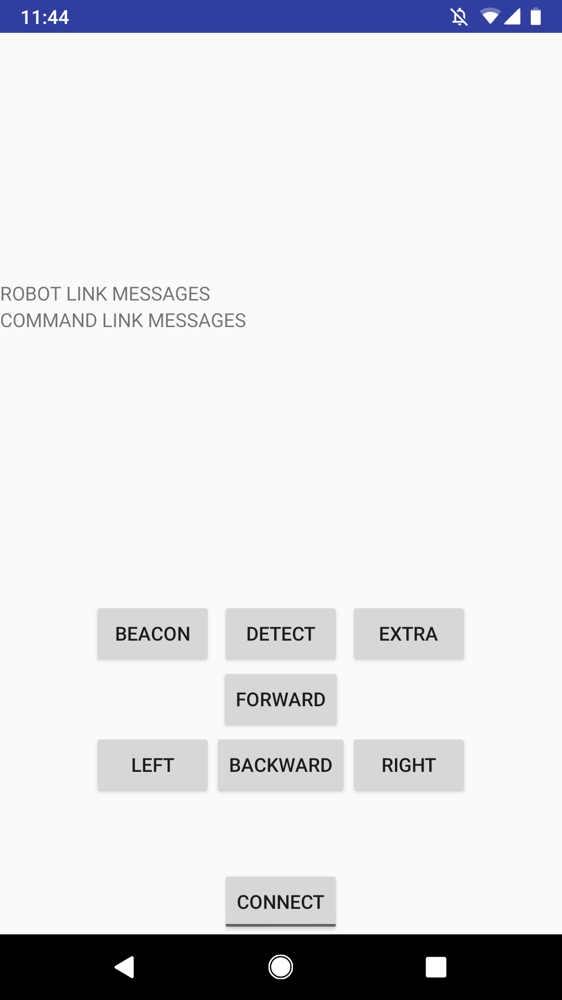

# Mars Rover Remote
A custom designed telnet controller for android that was created and awarded for creativity to control and communicate with the mars rover for CPR E 288 at ISU.

  

## Additional Information

Code is currently broken due to no longer being in the class and not being able to connect to the rover (which was one of the startup checks). I am in the process of fixing this and trying to create an animated rover in the app that will emulate the real one.

The goal of the project was to navigate a rover through rough terrain (potholes, poles which the rover could not touch, and a final payload zone to help the stranded astronauts). This was all without seeing the robot. The instructions were to use a terminal in Windows. I created this app to emulate the simplicity a navigator in the real world would need in a remote control for the rover.

## Credits
UX (simple/convenience over looks in this case)/Development: Jay Amin
Team Member for rover and lab: Tilden Chen
Thanks: TAs of CPR E 288 at Iowa State University
